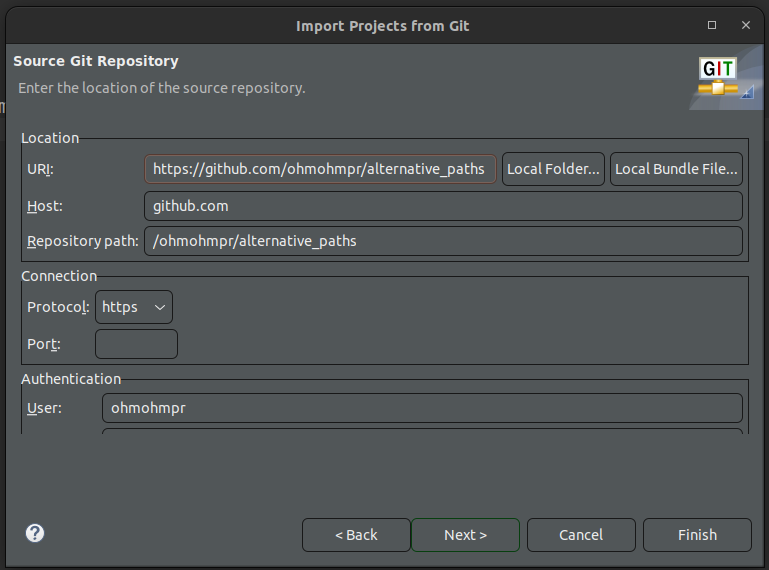
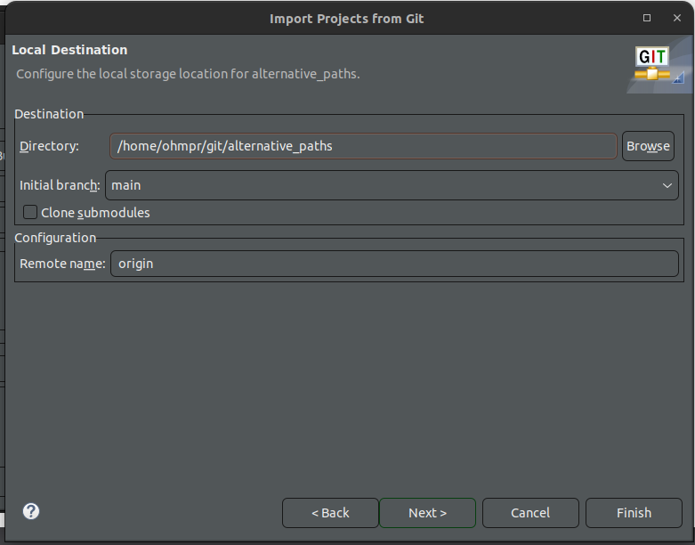
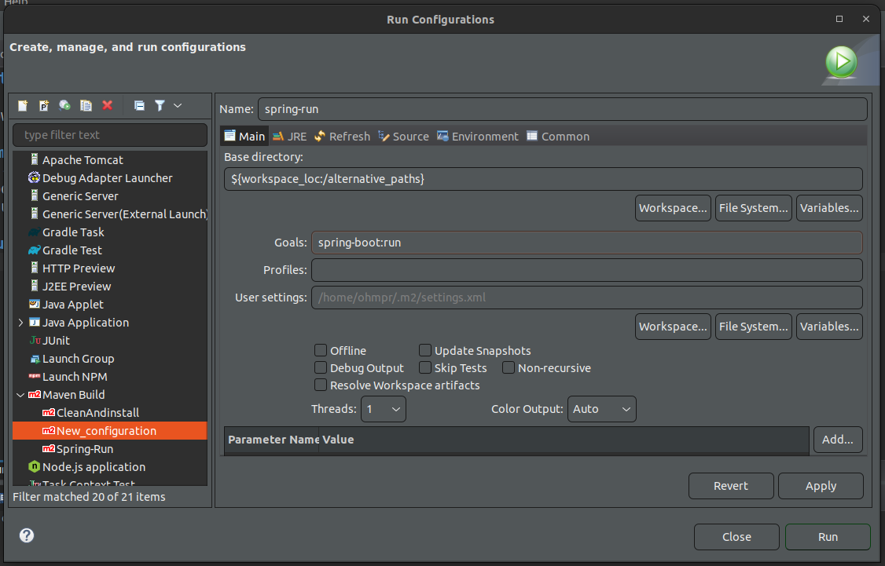

# Installation
Download eclipse application.

## Import
File -> import -> Git -> Project from Git(smart import) -> Clone URI.   

## Run the project.

## Web-Brownser
http://localhost:8080/lbsproject-lara-ohm/
